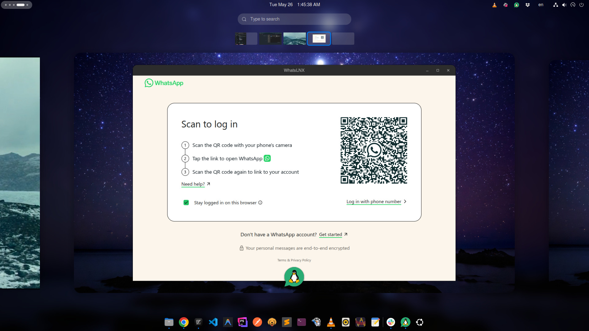
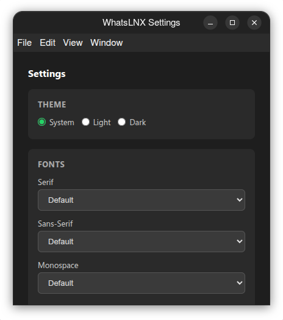

# WhatsLNX

A minimalist, high-performance unofficial WhatsApp desktop client for Linux.

[](LICENSE)
[](https://github.com/kmmuntasir/WhatsLNX/actions/workflows/ci.yml)
[](https://github.com/kmmuntasir/WhatsLNX/releases/latest)

WhatsLNX wraps [WhatsApp Web](https://web.whatsapp.com) inside a tailored Electron shell that prioritizes system-native behavior, Wayland compatibility, and flawless WebRTC (audio/video calling) support.

<p align="center">
  
</p>

<p align="center">
  
  
</p>

## Contents

- [Features](#features)
- [Installation](#installation)
- [Building from Source](#building-from-source)
- [Uninstallation](#uninstallation)
- [Configuration](#configuration)
- [Keyboard Shortcuts](#keyboard-shortcuts)
- [Deep Links](#deep-links)
- [Competitive Comparison](#competitive-comparison)
- [Supported Platforms](#supported-platforms)
- [Known Issues](#known-issues)
- [Contributing](#contributing)
- [License](#license)

## Features

- **Wayland & X11** — Auto-detected, no manual flags needed
- **Audio/Video Calling** — Automatic camera and microphone permissions
- **Native Notifications** — System notification bubbles via DBus
- **Native File Dialogs** — xdg-desktop-portal for uploads and downloads
- **Drag & Drop** — Drop files from Nautilus, Dolphin, or Thunar directly into chat
- **Screen Sharing** — Share your screen during calls (Wayland + X11, via PipeWire/xdg-desktop-portal)
- **Theme Sync** — Automatically follows your desktop's light/dark mode
- **Font Configuration** — Set Serif, Sans-Serif, and Monospace fonts via Settings
- **System Tray** — Tray icon with unread message count badge
- **Deep Links** — Handles `whatsapp://` URI scheme system-wide
- **Session Persistence** — Stay logged in between app restarts
- **Single Instance** — Prevents duplicate windows and session corruption
- **Auto-Update** — AppImage updates automatically (via GitHub Releases); DEB updates via `apt upgrade`

## Installation

### AppImage (Recommended)

Universal, no-install release. Works on any Linux distribution.

```bash
# Download the latest AppImage
wget https://github.com/kmmuntasir/WhatsLNX/releases/latest/download/WhatsLNX-*.AppImage

# Make it executable
chmod +x WhatsLNX-*.AppImage

# Run
./WhatsLNX-*.AppImage
```

### DEB (Ubuntu/Debian/Linux Mint)

**One-time setup:**

```bash
# Add the repository signing key
curl -fsSL https://kmmuntasir.github.io/WhatsLNX/whatslnx-archive-keyring.gpg \
  | sudo gpg --dearmor -o /usr/share/keyrings/whatslnx-archive-keyring.gpg

# Add the repository
echo "deb [arch=amd64 signed-by=/usr/share/keyrings/whatslnx-archive-keyring.gpg] \
  https://kmmuntasir.github.io/WhatsLNX stable main" \
  | sudo tee /etc/apt/sources.list.d/whatslnx.list

# Update package index
sudo apt update
```

**Install:**

```bash
sudo apt install whatslnx
```

**Upgrade (when new versions are published):**

```bash
sudo apt update && sudo apt upgrade whatslnx
```

**Uninstall:**

```bash
sudo apt remove whatslnx

# Optional: remove the repository
sudo rm /etc/apt/sources.list.d/whatslnx.list
sudo rm /usr/share/keyrings/whatslnx-archive-keyring.gpg
sudo apt update
```

## Building from Source

### Prerequisites

- Node.js 24+ and npm
- Linux (Ubuntu 24.04+ recommended)

### Build

```bash
git clone https://github.com/kmmuntasir/WhatsLNX.git
cd WhatsLNX
npm install
npm start        # Run in development mode
npm run build    # Build all packages (AppImage + DEB)
```

### Individual targets

```bash
npm run build:appimage
npm run build:deb
```

Build artifacts go to `dist/`.

## Uninstallation

### AppImage

```bash
rm WhatsLNX-*.AppImage
rm -rf ~/.config/whatslnx   # App settings and session data
```

### DEB

```bash
sudo apt remove whatslnx
```

### Remove shared data (all formats)

```bash
rm -rf ~/.config/whatslnx    # App settings
```

## Configuration

All settings are accessible via the **tray icon context menu** → **Settings**.

### Theme

| Option | Behavior |
|--------|----------|
| System (default) | Follows your desktop's light/dark theme automatically |
| Light | Forces light mode |
| Dark | Forces dark mode |

### Fonts

Configure **Serif**, **Sans-Serif**, and **Monospace** font families. All system fonts are detected automatically via `fc-list`. Click **Reset to Default** to clear custom fonts.

## Keyboard Shortcuts

| Shortcut | Action |
|----------|--------|
| Close window | Minimize to tray (app keeps running) |
| Tray left-click | Show/hide window |
| Tray right-click | Context menu |

## Deep Links

WhatsLNX registers as the system handler for `whatsapp://` URIs. Supported formats:

```
whatsapp://send?phone=1234567890
whatsapp://send?phone=1234567890&text=Hello
whatsapp://send?text=Hello
```

Clicking these links in any application will open WhatsLNX and navigate to the compose view.

## Competitive Comparison

| Feature | **WhatsLNX** | **WhatsDesk** | **Whatsie** | **WhatsApp for Linux** | **WhatsApp Web** |
|---------|:---:|:---:|:---:|:---:|:---:|
| Wayland support | Auto | Manual | Partial | Unknown | Browser-dependent |
| Audio/Video calling | Auto-permission | Broken in Snap | Yes | Unknown | Yes |
| Screen sharing | Yes | No | No | No | Yes |
| Native file dialogs | xdg-desktop-portal | Custom | Custom | Custom | Browser-dependent |
| Theme sync with OS | Auto | Manual | Manual | Manual | Via browser |
| System tray icon | Yes | Yes | Yes | Yes | No |
| Native notifications | Yes | Yes | Yes | Yes | Browser-dependent |
| Unread badge | Yes | No | Yes | No | Tab title only |
| Drag-and-drop files | Yes | Unknown | Unknown | Unknown | Yes |
| Font configuration | Yes (3 families) | No | No | No | No |
| Deep link support | `whatsapp://` | No | No | No | N/A |
| Session persistence | Yes | Yes | Yes | Yes | Browser-dependent |
| Auto-update | Yes | No | No | No | N/A |
| Package formats | AppImage, DEB | AppImage, DEB, Snap | Snap, AppImage, DEB | DEB, Flatpak | N/A |

## Supported Platforms

| Distribution | Status |
|-------------|--------|
| Ubuntu 24.04 / 26.04 | Primary |
| Linux Mint 21.x / 22.x | Primary |
| Elementary OS 7 / 8 | Primary |
| Debian 12 (Bookworm) / 13 (Trixie) | Primary |
| Fedora 40+ | Secondary (AppImage) |
| Arch Linux / Manjaro | Secondary (AppImage) |

### Desktop Environments

Tested on GNOME 46+ (Wayland/X11), KDE Plasma 6+ (Wayland/X11), XFCE 4.18+.

## Known Issues

- **GNOME tray icons** require the [AppIndicator](https://extensions.gnome.org/extension/615/appindicator-support/) extension
- **Screen sharing on Wayland** requires PipeWire and xdg-desktop-portal (pre-installed on most modern distros)
- WhatsApp Web is a third-party service — feature availability depends on Meta's deployment

## Contributing

Bug reports and feature requests are welcome! Please read the [contributing guidelines](CONTRIBUTING.md) before submitting a PR.

See [ARCHITECTURE.md](docs/ARCHITECTURE.md) for a codebase overview.

## Security

Found a vulnerability? Please report it privately — see [SECURITY.md](SECURITY.md).

## Changelog

See [CHANGELOG.md](CHANGELOG.md) for release history.

## License

[GPL-3.0](LICENSE)
